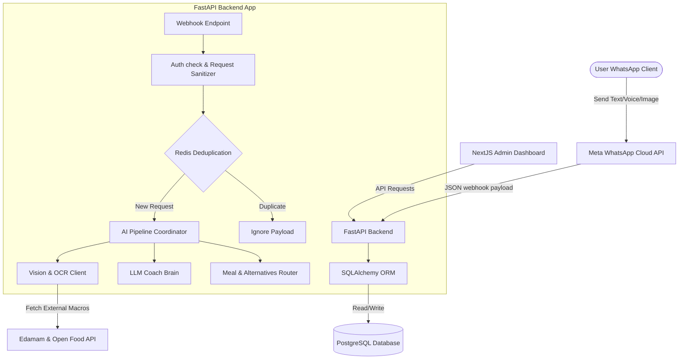
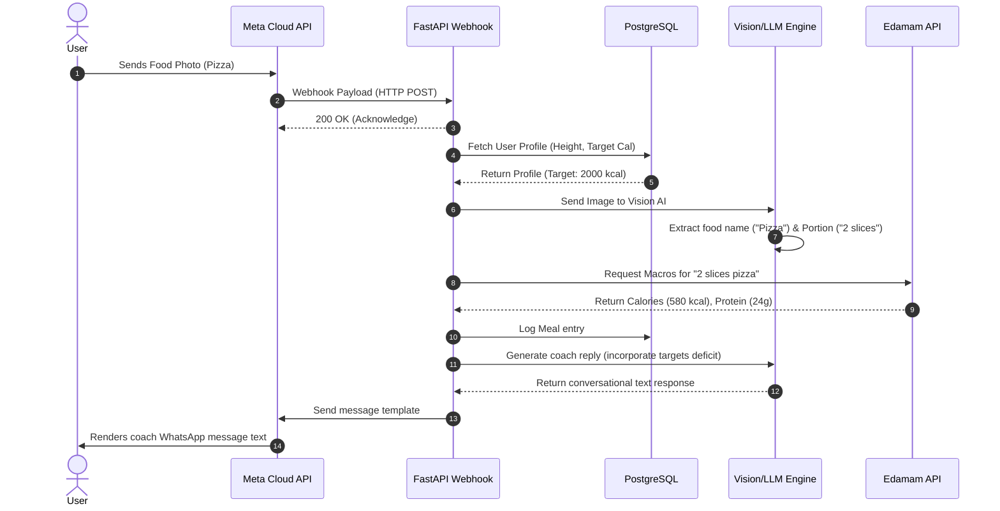
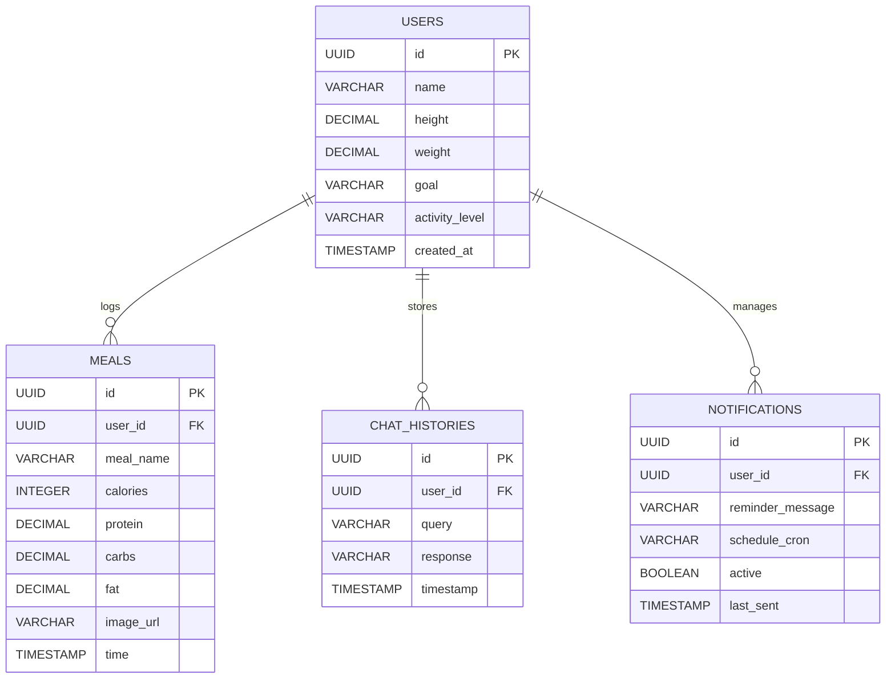

# Software Architecture (ARCHITECTURE.md)

This document describes the high-level system architecture, component integrations, data flows, and AI pipeline topology for NutriChat AI.

---

## 1. System Components Overview

The system consists of three main segments:
1.  **Client Channel**: User communicates exclusively through WhatsApp using text, images, or voice inputs.
2.  **API Backend Server**: FastAPI asynchronous server managing webhooks, database persistence, caching, and AI logic coordination.
3.  **Admin Dashboard**: NextJS dashboard reporting analytics, system logs, database stats, and active sessions.

---

## 2. Webhook & Message Sequence Flow

Below is the workflow sequence when a food photo is sent by a user:

---

## 3. Database ERD (Entity Relationship Diagram)

