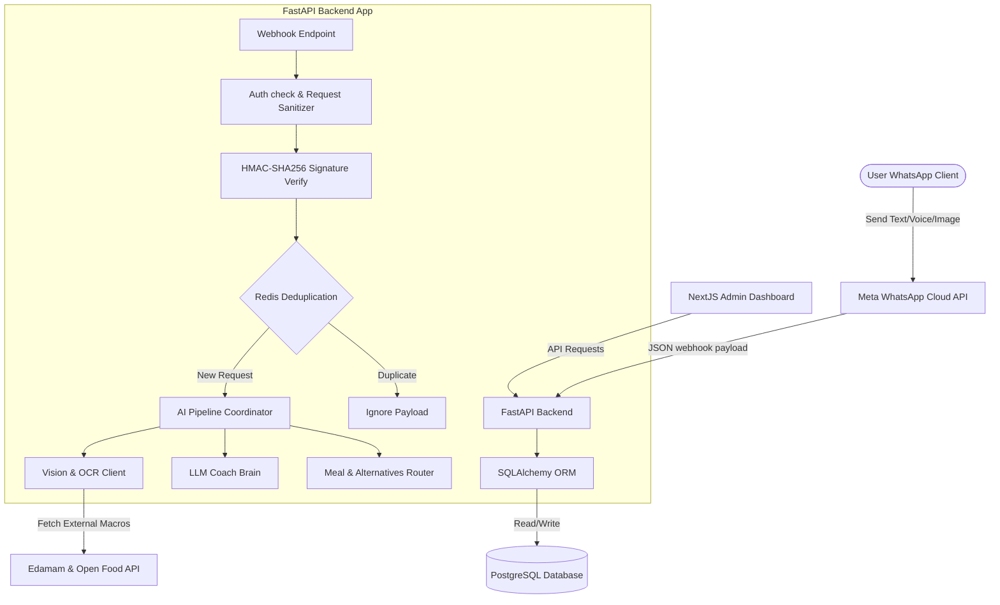
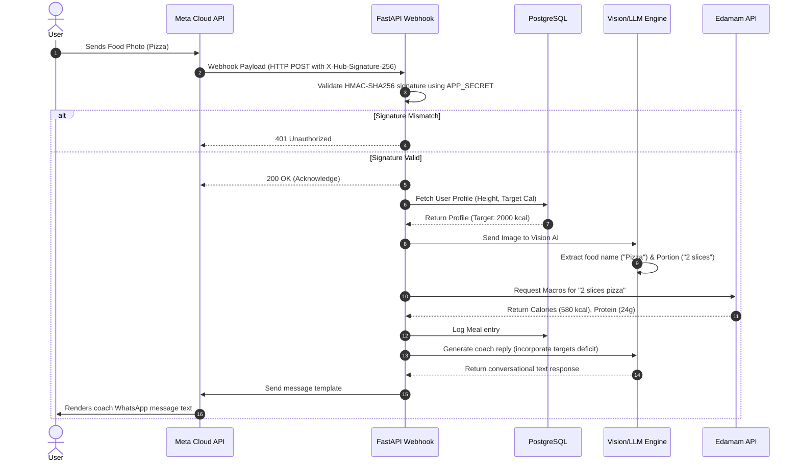
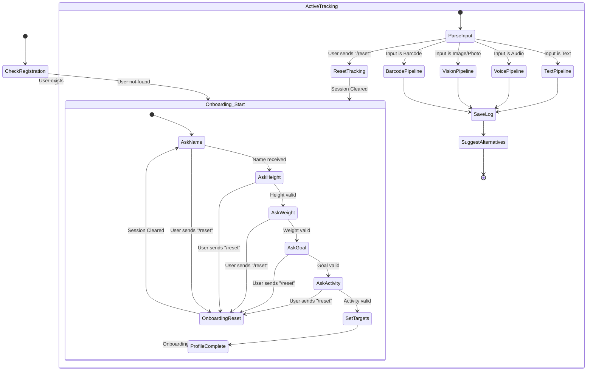
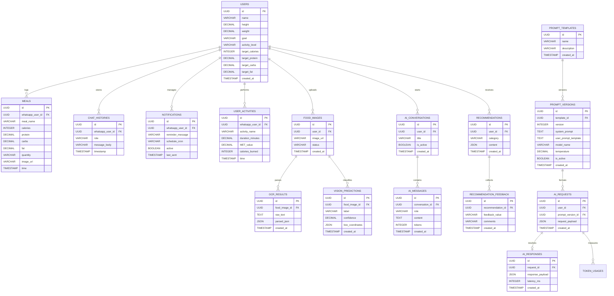
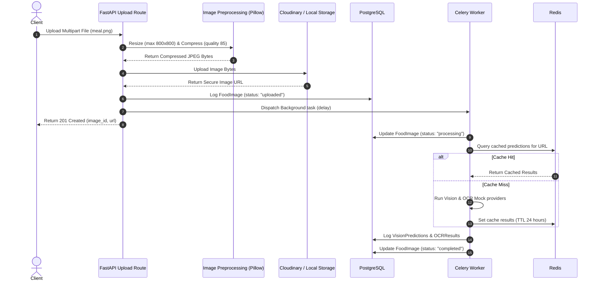

# Software Architecture (ARCHITECTURE.md)

This document describes the high-level system architecture, component integrations, data flows, and AI pipeline topology for NutriChat AI.

---

## 1. System Components Overview

The system consists of three main segments:
1.  **Client Channel**: User communicates exclusively through WhatsApp using text, images, or voice inputs.
2.  **API Backend Server**: FastAPI asynchronous server managing webhooks, database persistence, caching, and AI logic coordination.
3.  **Admin Dashboard**: NextJS dashboard reporting analytics, system logs, database stats, and active sessions.

---

## 2. Webhook & Message Sequence Flow

Below is the workflow sequence when a food photo is sent by a user:

---

## 3. Conversational State Machine (Onboarding & Reset Flow)

When an incoming message event is delivered, the backend checks the user's registration status. Below is the state machine representation of the onboarding flow, including the on-demand `/reset` trigger:

---

## 4. Database ERD (Entity Relationship Diagram)

Includes the added `user_activities` table mapping exercise logs and MET-based calculations.

---

## 5. Computer Vision & OCR Upload Pipeline Sequence

Below is the execution flow of the Image Preprocessing, Cloudinary upload, and Celery background task:

---

## 6. Architectural Quality Standards

*   **DRY & Repository Pattern**: All database queries must inherit from a base repository class to avoid repeating SQLAlchemy connection logic.
*   **Asynchronous-First**: Route controllers leverage asynchronous databases routines to prevent blocking the worker event loops during heavy concurrent read operations.
*   **Decoupled AI Engine**: Prompt orchestration classes are isolated from route logic. Changing the underlying vision AI client (e.g. switching from Gemini to OpenAI) requires no modifications to webhook routes.
