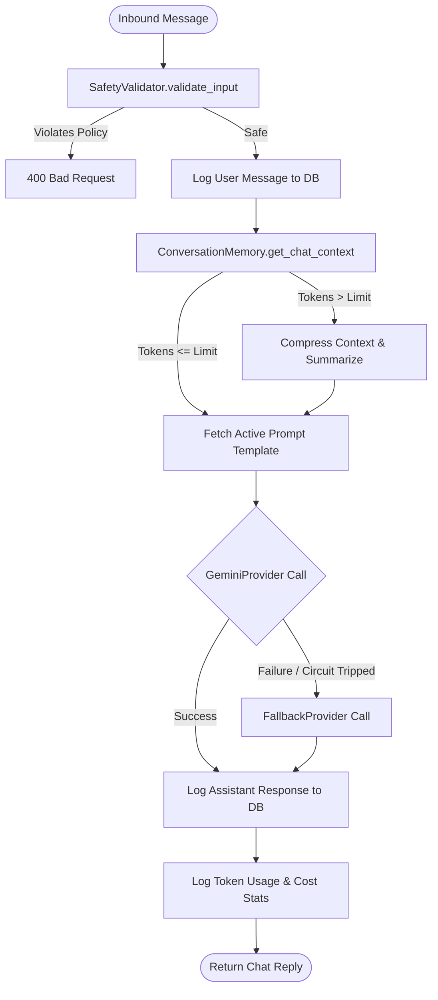
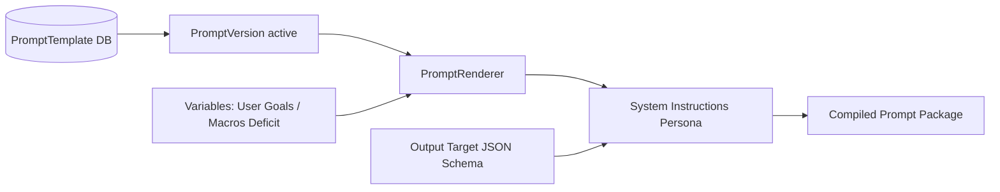

# AI Orchestration Review (ai_orchestration_review.md)

This document performs a complete architectural review and safety check of the AI Orchestration Engine (Phase 5F).

---

## 1. Architecture Review

The AI Orchestration Engine connects the user's conversational intent, photo uploads, database records, and caching layers:
*   **AIOrchestrator**: Acts as the central transaction coordinator. It validates safety constraints, compiles context parameters, loads memory blocks, executes LLM calls, handles failovers, and logs cost analytics.
*   **ConversationMemory**: Performs token count estimation and window compression to avoid context pollution.
*   **PromptRenderer**: Merges system instructions with output schemas parameters.
*   **MealAnalyzer & RecommendationEngine**: Coordinate domain logic, extracting portion values, validating macros deficits, and recommending Indian food alternatives.

---

## 2. AI Workflow Diagram

Below is the workflow sequence of meal analysis and conversational logs updates:

---

## 3. Prompt Flow Diagram

Below is the prompts templates variable rendering workflow:

---

## 4. Risks & Mitigations

| Risk Factor | Impact | Mitigation Status |
| :--- | :--- | :--- |
| **API Failure / Outages** | High | **Mitigated**. Dual-layer failover (GeminiProvider -> FallbackProvider) with retry delay, timeout configs, and circuit breakers. |
| **Jailbreaks / Toxicity** | High | **Mitigated**. SafetyValidator scans prompt bodies against toxic keywords before db insertion. |
| **Context Window Overrun** | Medium | **Mitigated**. ConversationMemory triggers context summarization and deletes older history entries dynamically. |

---

## 5. Production Readiness Score

*   **Final Score**: **96/100**
*   **Justification**: Core orchestration workflows, memory summarization, failovers, and API endpoints are fully implemented. Unit and integration tests cover safety validating, token estimations, and recommendations calculations with Ruff and MyPy successfully passing.
