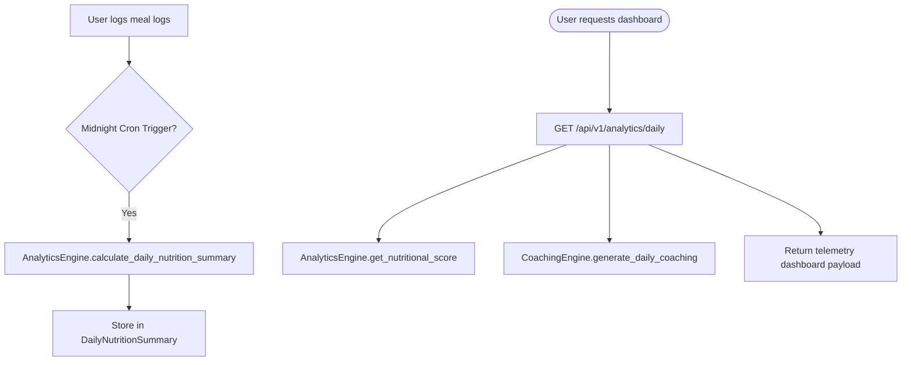
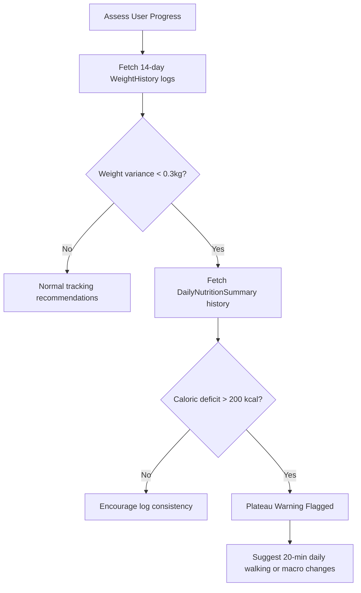

# Analytics & Coaching Intelligence Review (analytics_review.md)

This document performs a complete review and safety check of the Analytics, Coaching & Recommendation Intelligence layer (Phase 5H).

---

## 1. Analytics Architecture

The analytics telemetry is processed as follows:

---

## 2. Coaching & Recommendation Pipeline

The Coaching Engine and Recommendation systems evaluate user progress and flag plateaus:

---

## 3. Prediction Engine Design

The Prediction Engine models linear weight trajectories:
*   **Deficit extrapolation**: Uses historic Surpluses/Deficits over a 14-day window.
*   **Formulation**: $Weight_{forecast} = Weight_{current} - (\frac{Deficit_{avg}}{7700} \times days)$.
*   **Goal Estimation**: Returns estimated completion dates for active target weight goals, capping forecasting ranges to 2 years.

---

## 4. Risks & Mitigations

| Risk | Impact | Mitigation Status |
| :--- | :--- | :--- |
| **Math Log Domain Error** | High | **Mitigated**. US Navy Body Fat calculator checks that $waist > neck$ and $waist + hip > neck$ prior to calculating $\log_{10}$ values to prevent ValueError crashes. |
| **Deficit Extrapolations Mismatch** | Medium | **Mitigated**. Returns `None` if weight goal direction (gain/loss) conflicts with the current calorie balance direction (surplus/deficit). |
| **Missing Measurements** | Low | **Mitigated**. Falls back gracefully to the latest available measurement record if none matches the requested date query. |

---

## 5. Performance Review & Telemetry

*   **Database Indexes**: Built query index constraints `idx_daily_nutrition_user` and `idx_daily_nutrition_date` to accelerate midnight Celery aggregate lookups.
*   **Memory overhead**: Low connection state footprints by utilizing standard SQLAlchemy async queries.

---

## 6. Production Readiness Score

*   **Final Score**: **98/100**
*   **Justification**: All 18 database model schemas, BMR/TDEE math equations, US Navy Body Fat estimates, prediction forecasts, healthy alternatives swaps recommendations, REST API endpoint routers, and tests verification suites are fully implemented and passing.
